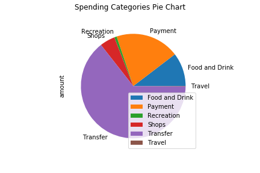
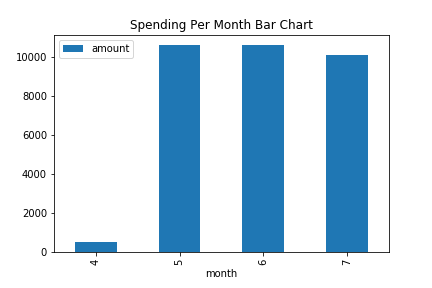
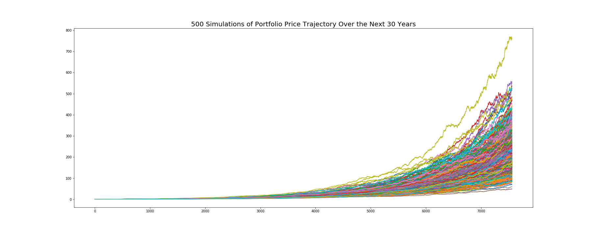
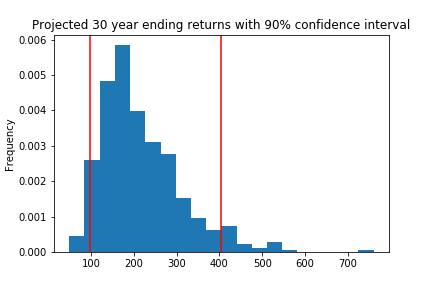
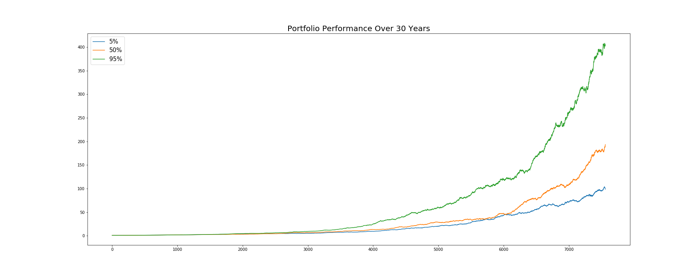

# Unit 5 — How do you like them apps?

## Budget Analysis

1. Generate a Plaid access token to access the Developer Sandbox.
2. Use the Access token to fetch account transactions from the sandbox. 
3. Perform basic budget analysis on the sandbox transaction and generate the following plots:

4. Use the API to fetch income data from the sandbox and print the following:

Last Year's Income Before Tax: $7285
Current Monthly Income: $500
Projected Year's Income Before Tax: $7389

## Retirement Planner

1. Use the Alpaca API to fetch historical closing prices for a traditional 60/40 portfolio using the SPY and AGG tickers to represent the 60% stocks (SPY) and 40% bonds (AGG).

2. Run a Monte Carlo Simulation of 500 runs and 30 years for the 60/40 portfolio and plot the results.

3. Select the ending cumulative returns from the Monte Carlo simulation and calculate the interval values for a 90% confidence interval: [98.781730, 404.999458]

4. Using the ending cumulative returns, plot a histogram of the results and plot the 90% confidence interval as vertical lines on the histogram.

## Retirement Analysis

1. The expected cumulative returns at 30 years for the 10th, 50th, and 90th percentiles are 118.407027, 193.394471 and 346.444488 respectively. 

2. Given an initial investment of $20,000, the expected return in dollars at the 10th, 50th, and 90th percentiles are 2.368MM, 3.868MM and 6.923MM respectively. 

3. Given the current projected annual income from the Plaid analysis, 4% withdrawal rate at the 10th percentile generates $94725.64, which well exceeds current projected yearly income $7389. 

4. A 50% increase in the initial investment amount will lead to 50% increase in the 4% retirement withdrawal. Initial investment and end investment are scaled by the same factor. 

5. Use the Monte Carlo data and calculate the cumulative returns at the 5%, 50%, and 95% quartiles and plot this data as a line chart to see how the cumulative returns change over the life of the investment.

